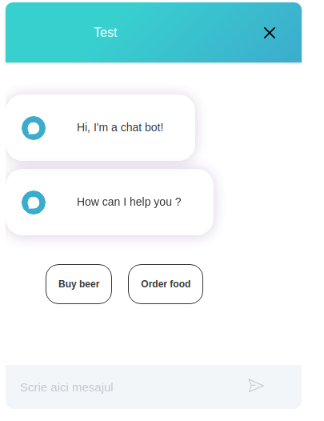

# hoopoe-chatbot project

## UI

The UI chatbot ui is written in Svelt framework.

All of the UI source code lives in `ui` folder and it's built using Rollup.

### Installing and launching the UI

`console cd ui npm i npm run dev`

A development server will start on http://localhost:5000 , along with live
reload and all the usual dev goodies.

